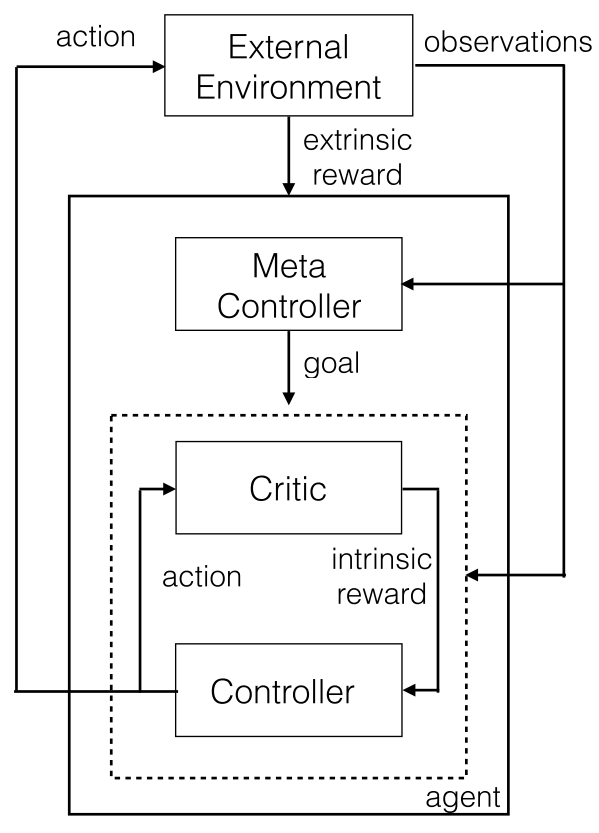

# Summary

#### Link

[Hierarchical Deep Reinforcement Learning: Integrating Temporal Abstraction and Intrinsic Motivation](https://arxiv.org/abs/1604.06057)

http://media.nips.cc/nipsbooks/nipspapers/paper_files/nips29/reviews/1826.html

#### Author/Institution

Tejas D. Kulkarni, Karthik R. Narasimhan, Ardavan Saeedi, Joshua B. Tenenbaum  
MIT

## What is 

Proposed a RL agent with hierarchical structure with intrinsic sub-goals.

## Comparison with previous researches. What are the novelties/good points?

#### Hierarchical RL

## Key points

There is top level module (meta-controller) and lower-level module for each subgoals. Typical architecture of HRL with options.

They used 'intrinsic' motivation to make an agent work towards sub-goals.

## How the author proved effectiveness of the proposal?

Two experiments.

1. Discrete stochastic decision process
2. Montezuma's Revenge

## Any discussions?

They wrote "In this work, we built a custom object detector that provides plausible object candidates" so it seems they feed some key object images to the agent and let it walk towards those objects. I'm curious about this point (how much hand engineering they actually did...)

## What should I read next?

[Horde: A scalable real-time architecture for learning knowledge from unsupervised sensorimotor interaction](https://dl.acm.org/citation.cfm?id=2031726)
