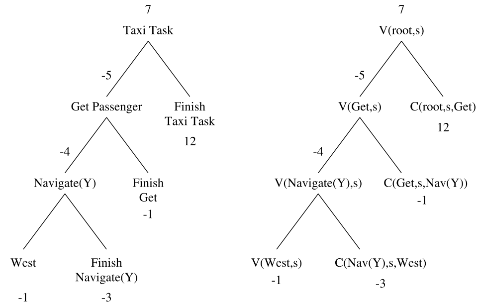

# Summary

#### Link

[Hierarchical Reinforcement Learning with the MAXQ Value Function Decomposition](https://arxiv.org/abs/cs/9905014)

#### Author/Institution

Thomas G. Dietterich
Oregon State University

## What is this

Proposed MAXQ decomposition by which express value function in a hierarchical manner.

* decomposing the target Markov decision process (MDP) into a hierarchy of smaller MDPs
* decomposing the value function of the target MDP into an additive combination of the value functions of the smaller MDPs

In addition, proposed MAXQ Q-learning algorithm based on MAXQ, which is an online model-free algorithm. The author proved that this algorithm is guaranteed to converge "recursive optimal policy" which is a locally optimal policy.

## Comparison with previous researches. What are the novelties/good points?

Three approaches to express subtasks
1. to define each subtask in terms of a fixed policy that is provided by the programmer: Options, 
2. to define each subtask in terms of a non-deterministic finite-state controller: HAM
3. to define each subtask in terms of a termination predicate and a local reward function
The approach in this paper corresponds to 3

In this context, these are the previous works

- [Transfer of learning by composing solutions of elemental sequential tasks, Singh (1992a)](https://link.springer.com/article/10.1007%2FBF00992700)
- [Hierarchical reinforcement learning: Preliminary results, Kaelbling (1993)](http://people.csail.mit.edu/lpk/papers/ml93.ps)
- [Feudal Reinforcement Learning, Dayan and Hinton (1993)](http://www.cs.toronto.edu/~fritz/absps/dh93.pdf)
- [Decomposition techniques for planning in stochastic domains, Dean and Lin (1995)](https://dl.acm.org/citation.cfm?id=1643031.1643045)

## Key points

First, introduce $Q(p,s,a)$ which is the expected total reward of performing subtask $p$ starting in state s, executing action $a$ and then following the optimal policy thereafter.

Then, decompose it as follows:

$Q(p,s,a) = V(a,s) + C(p,s,a)$

- $V(a,s)$: The value function for the subtask $a$
    - the expected total reward received while executing action $a$
- $C(p,s,a)$: Completion function
    - the expected total reward of completing parent task $p$ after $a$ has returned

##### A Learning Algorithm for the MAXQ Decomposition

A recursively optimal policy is an assignment of policies to each individual subtask such that the policy for each subtask is optimal given the policies assigned to all of its descendants

## How the author proved effectiveness of the proposal?

The taxi problem.
This environment is implemented in [OpenAI Gym](https://gym.openai.com/envs/Taxi-v1/)

## Any discussions?
## What should I read next?

MAXQ itself is not a method to learn the structure of hierarchy itself. Techniques like [Bayesian Belief Nets](https://webdocs.cs.ualberta.ca/~rgreiner/bn.html) (Pearl, 1998) would be one of the key as the author wrote in the paper.

> Some readers may be disappointed that MAXQ provides no way of learning the structure of
the hierarchy. Our philosophy in developing MAXQ (which we share with other reinforcement learning researchers, notably Parr and Russell) has been to draw inspiration from the development of Belief Networks (Pearl, 1988). Belief networks were first introduced as a formalism in which the knowledge engineer would describe the structure of the networks and domain experts would provide the necessary probability estimates. Subsequently, methods were developed for learning the probability values directly from observational data. Most recently, several methods have been developed for learning the structure of the belief networks from data, so that the dependence on the knowledge engineer is reduced.

In terms of terminate condition of a subtask,Dean and Lin (1995) could be a good reference

> the termination predicate method requires the programmer to guess the relative desirability of the different states in which the subtask might terminate. This can also be difficult, although Dean and Lin show how these guesses can be revised automatically by the learning algorithm"

