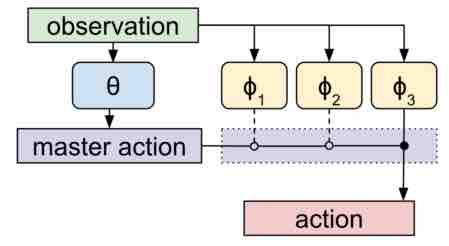

# Summary

#### Link

[Meta Learning Shared Hierarchies](https://arxiv.org/abs/1710.09767)

#### Author/Institution

Kevin Frans, Jonathan Ho, Xi Chen, Pieter Abbeel, John Schulman  
OpenAI, UC Berkeley

## What is this

## Comparison with previous researches. What are the novelties/good points?

* "Hierarchical RL" context
    - multi-task setting as a way to learn temporally extended primitives.
* "Meta learning" context
    - MLSH (our method) optimizes to learn quickly over a large number of policy gradient updates in the RL setting
    - the prior work on metalearning optimizes to learn as much as possible in a small number of gradient updates

## Key points

##### Parameters and the objective

$\phi$: a set of parameters that is shared between tasks  
$\theta$: a set of per-task parameters, which is updated as the agent learns about the current task $M$

Meta Learning objective: $maximize_\phi E_{M \sim P_M, t=0...T-1}[R]$

##### Architecture

$\theta$ parametrizes a stochastic policy (neural network), called the master policy whose action is to choose the index $k$ of $\phi_k$

The master policy samples actions at a fixed frequency of $N$ timesteps, i.e., at $t=0, N, 2Nn ...$

## How the author proved effectiveness of the proposal?

* 2D moving bandits
* Ant Twowalk
* Humanoid

[code and supplemental videos are available](https://blog.openai.com/learning-a-hierarchy/)

##### Network architecture and learning algorithm

Multi Layer (2 layer) Perceptron for both master and sub-policies with a hidden size 64.
Policy gradient ([PPO](https://blog.openai.com/openai-baselines-ppo/))

##### Hyper parameters

* Learning rate for $\theta$: 0.01
* Learning rate for $\phi$: 0.0003
* Batch size (D): 2000

## Any discussions?

## What should I read next?

##### Hierarchical Reinforcement Learning

* Learning options automatically
    - earns a master policy, where sub-policies are defined according to information-maximizing statistics
        - [Strategic attentive writer for learning macro-actions](https://arxiv.org/abs/1606.04695) (NIPS'16)
        - [Probabilistic inference for determining options in reinforcement learning](https://link.springer.com/article/10.1007/s10994-016-5580-x)
        - [Stochastic neural networks for hierarchial reinforcement learning](https://arxiv.org/abs/1704.03012) (ICLR'17)
    - end-to-end learning of hierarchy through the options framework
        - [The option-critic architecture](https://arxiv.org/abs/1609.05140) (AAAI'17)
    - Decomposition of complicated tasks into sub-goals
        - [Autonomous extracting a hierarchical structure of tasks in reinforcement learning and multi-task reinforcement learning](https://arxiv.org/abs/1709.04579)

> (Vezhnevets et al., 2016; Daniel et al., 2016). Florensa et al. (2017) learns a master policy, where sub-policies are defined according to information-maximizing statistics. Bacon et al. (2016) introduces end-to-end learning of hierarchy through the options frame- work. Other methods (Dayan & Hinton, 1993; Vezhnevets et al., 2017; Ghazanfari & Taylor, 2017) aim to learn a decomposition of complicated tasks into sub-goals.

##### Meta learning

* [Learning to learn by gradient descent by gradient descent](https://arxiv.org/abs/1606.04474) (NIPS'16)
    - uses recurrent LSTM
* [Rl2: Fast reinforcement learning via slow reinforcement learning](https://arxiv.org/abs/1611.02779) (ICLR'17)
* [Learning to reinforcement learn](https://arxiv.org/abs/1611.05763)
* [Model-agnostic meta-learning for fast adaptation of deep networks](https://arxiv.org/abs/1703.03400) (ICML'17)

> There has also been work in metalearning, where information from past experiences is used to learn quickly on specific tasks. Andrychowicz et al. (2016) proposes the use of a recurrent LSTM network to generate parameter updates. Duan et al. (2016) and Wang et al. (2016) aim to use recurrent networks as the entire learning process, giving the network the same inputs a traditional RL method would receive. Mishra et al. (2017) tackles a similar problem, utilizing temporal convolutions rather than recurrency. Finn et al. (2017) accounts for fine-tuning of a shared policy, by optimizing through a second gradient step. While the prior work on metalearning optimizes to learn as much as possible in a small number of gradient updates, MLSH (our method) optimizes to learn quickly over a large number of policy gradient updates in the RL setting—a regime not yet explored by prior work.

